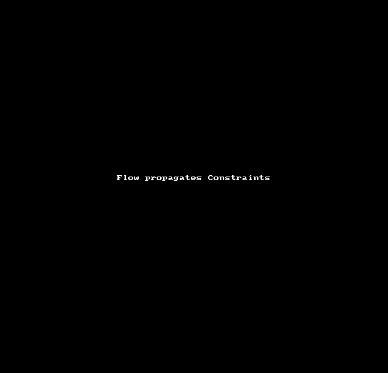

## What's this?
A demo of the power of React PropTypes with Flow's static analysis. [Blog post/Video](https://react.rocks/blog/post/propTypes_React_Flow/).

### Documented Props

Props must be documented.

### Enforced via Static Analysis

Flow understands and propagates constraints to call sites.

### How to use
* `git clone git@github.com:winkler1/flow-eslint-react-demo.git && cd flow-eslint-react-demo && git co react-13 && npm install`
* `npm run lint` to confirm eslint working.
* Watch your code: `./node_modules/.bin/onchange "**/*.js" .babelrc .eslintrc .flowconfig -- ./run_checks.sh`
* Make changes in src/App.js. As you change, ESLint and Flow should run checks and give feedback.